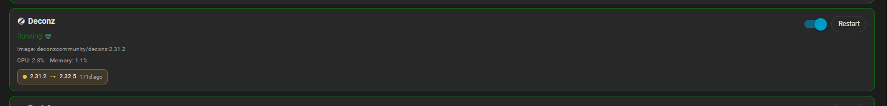

# Docker Card Extended

An extended version of Docker Card, inspired by [vineetchoudhary/lovelace-docker-card](https://github.com/vineetchoudhary/lovelace-docker-card), that lets you view and control your Docker containers from Home Assistant. When paired with the official Home Assistant Portainer integration, every entity shown below already exists — no templates or shell commands required.


## Features

- Compact overview of your Docker host (container counts, Docker version, OS, daemon state)
- Auto-updating container list with live state badges and control actions
- Collapsible container section
- Responsive multi-column layout that adapts to screen size — set `columns: 3` for three columns on wide screens, automatically reduces on smaller screens
- Per-container icons, health status indicators, and image version display
- **WUD update tracking** — shows available updates with current → new version and how many days the update has been available (requires a running [What's Up Docker](https://github.com/getwud/wud) instance and the [WUD Updates Monitor integration](https://github.com/johro897/What-s-up-Docker-Updates-Monitor))
- Theme-aware styling with configurable running vs not-running accent colors
- Works out-of-the-box with entities from the Portainer integration; also supports any toggle-friendly domain (`switch`, `input_boolean`, `light`, etc.)
- Optional tap/hold actions per container row for quick navigation, service calls, or external links

## Requirements

- Home Assistant 2025.8 or newer
- Docker managed via the official Portainer integration (provides all referenced sensors, switches, and buttons)
- **Optional but recommended:** A running [What's Up Docker (WUD)](https://github.com/getwud/wud) instance with the [WUD Monitor](https://github.com/johro897/wud-monitor) HA integration installed — required for update tracking per container
- Optional: For non-Portainer environments, equivalent entities (sensors, binary_sensors, switches, scripts, etc.) that expose Docker data and operations

> [!IMPORTANT]
> This card **does not** fetch Docker data directly. It visualises data exposed through the standard Home Assistant entity model. Example helpers are included below for non-Portainer setups; if you already use the Home Assistant Portainer integration, you can plug its entities directly into the card.

---

## Installation

### 1. Via HACS (recommended)

Installation is easiest via [HACS](https://hacs.xyz/). Once you have HACS set up, follow the [instructions for adding a custom repository](https://hacs.xyz/docs/faq/custom_repositories):

1. In HACS, go to **Frontend → ⋮ → Custom repositories**
2. Paste `https://github.com/johro897/docker-card-extended` and choose **Dashboard**
3. Click **Add**, then locate **Docker Card Extended** under **Frontend** and install it
4. Reload Lovelace resources (or restart Home Assistant)

[](https://my.home-assistant.io/redirect/hacs_repository/?owner=johro897&repository=docker-card-extended&category=dashboard)

### 2. Manual install

1. Copy `docker-card.js` to `/config/www/docker-card-extended/docker-card.js`
2. Add the resource via **Settings → Dashboards → Resources → +**:
   ```yaml
   url: /local/docker-card-extended/docker-card.js
   type: module
   ```
3. Hard-refresh your browser (`Ctrl/Cmd + Shift + R`)

---

## WUD update tracking

To show update badges on containers you need:

1. A running [What's Up Docker](https://github.com/getwud/wud) instance (tested with WUD 8.2+)
2. The [WUD Updates Monitor](https://github.com/johro897/What-s-up-Docker-Updates-Monitor) integration installed in Home Assistant
3. Each container in WUD labelled with `wud.watch: "true"` in its `docker-compose.yml`

Once installed, the integration creates one sensor per monitored container. Add the sensor to the card using `update_entity`:

```yaml
containers:
  - name: ESPHome
    status_entity: sensor.docker_esphome_state
    control_entity: switch.esphome_container
    update_entity: sensor.esphome_update_available   # ← WUD sensor
    icon: mdi:chip
```

When an update is available the card shows an inline badge with:
- Current version → new version
- How many days the update has been available


> [!NOTE]
> Without a WUD instance and the WUD Updates Monitor integration, `update_entity` has no effect — the rest of the card works normally.

---

## Example configuration

```yaml
type: custom:docker-card
title: Docker @ MyServer
containers_expanded: true
columns: 3
docker_overview:
  container_count: sensor.docker_containers_total
  containers_running: sensor.docker_containers_running
  containers_stopped: sensor.docker_containers_stopped
  docker_version: sensor.docker_version
  image_count: sensor.docker_images
  operating_system: sensor.host_os
  operating_system_version: sensor.host_os_version
  status: binary_sensor.docker_daemon_status
running_color: "var(--state-active-color)"
not_running_color: "#c22040"
containers:
  - name: Home Assistant
    status_entity: sensor.docker_home_assistant_state
    control_entity: switch.home_assistant_container
    restart_entity: button.home_assistant_restart_container
    cpu_entity: sensor.home_assistant_cpu_usage
    memory_entity: sensor.home_assistant_memory_usage
    image_version_entity: sensor.docker_home_assistant_image
    health_entity: sensor.docker_home_assistant_health
    icon: mdi:home-assistant
    tap_action:
      action: more-info
      entity: sensor.docker_home_assistant_state
  - name: ESPHome
    status_entity: sensor.docker_esphome_state
    control_entity: switch.esphome_container
    restart_entity: button.esphome_restart_container
    update_entity: sensor.esphome_update_available
    icon: mdi:chip
  - name: Deconz
    status_entity: sensor.docker_deconz_state
    control_entity: switch.deconz_container
    restart_entity: button.deconz_restart_container
    cpu_entity: sensor.deconz_cpu_usage
    memory_entity: sensor.deconz_memory_usage
    image_version_entity: sensor.docker_deconz_image
    health_entity: sensor.docker_deconz_health
    update_entity: sensor.deconz_update_available
    icon: mdi:zigbee
```

---

## Quick start (Portainer integration)

1. Install the **Portainer** integration via **Settings → Devices & Services → + → Portainer**
2. Confirm entities such as `sensor.docker_containers_running`, `switch.docker_<container>`, and `button.docker_restart_<container>` exist
3. Add the YAML snippet above to your dashboard (**Edit Dashboard → Add Card → Manual → paste YAML**)
4. Optionally adjust `running_color` or `not_running_color` to match your theme

---

## Configuration options

### Card options

| Option | Required | Default | Description |
| --- | --- | --- | --- |
| `title` | No | `Docker Card` | Card header text |
| `containers_expanded` | No | `false` | Expand container list on load |
| `columns` | No | `1` | Maximum number of columns — reduces automatically on smaller screens |
| `running_color` | No | Theme value | Global accent color for running containers |
| `not_running_color` | No | Theme value | Global accent color for stopped containers |
| `docker_overview` | No | — | High-level Docker host stats |
| `containers` | **Yes** | — | Array of container definitions |

### docker_overview options

| Option | Description |
| --- | --- |
| `status` | Binary sensor for overall Docker daemon state |
| `container_count` | Total number of containers |
| `containers_running` | Number of running containers |
| `containers_stopped` | Number of stopped containers |
| `docker_version` | Docker version string |
| `image_count` | Number of Docker images |
| `operating_system` | Host OS name |
| `operating_system_version` | Host OS version |

### Container options

| Option | Required | Description |
| --- | --- | --- |
| `name` | No | Display name (defaults to entity friendly name) |
| `icon` | No | MDI icon, e.g. `mdi:home-assistant` |
| `status_entity` | Preferably | Entity whose state represents container status |
| `control_entity` | Conditional | Entity supporting `turn_on`/`turn_off` to start/stop the container |
| `control_domain` | No | Override domain for `control_entity` |
| `restart_entity` | No | Entity to trigger a restart (`button`, `switch`, `script`, etc.) |
| `restart_domain` | No | Override domain for `restart_entity` |
| `cpu_entity` | No | Sensor for CPU usage (%) |
| `memory_entity` | No | Sensor for memory usage (%) |
| `image_version_entity` | No | Sensor showing the current image tag/version |
| `health_entity` | No | Sensor for container health (`healthy`, `unhealthy`, `starting`) |
| `update_entity` | No | WUD sensor for update tracking — requires WUD + WUD Updates Monitor integration |
| `running_color` | No | Per-container override for running accent color |
| `not_running_color` | No | Per-container override for stopped accent color |
| `running_states` | No | Custom list of states that count as "running" |
| `stopped_states` | No | Custom list of states that count as "stopped" |
| `tap_action` | No | Action on row tap (standard Lovelace action object) |
| `hold_action` | No | Action on long-press |
| `hold_delay` | No | Hold detection delay in ms (default: `500`) |
| `switch_entity` | No | Legacy alias for `control_entity` |

> **Tip:** `binary_sensor` entities are read-only. Use `switch`, `input_boolean`, or similar for `control_entity` so the card can call `turn_on`/`turn_off`.

Color values fall back to Home Assistant theme variables (`var(--state-active-color)`, `var(--state-error-color)`) when omitted. The legacy key `stopped_color` still maps to `not_running_color` for backward compatibility.

---

## Styling

- **Accent colors:** Set `running_color` and `not_running_color` globally or per-container to highlight critical services
- **Running/Total indicator:** The overview pill turns the not-running color when running count differs from total — handy for spotting issues at a glance
- **Theme alignment:** The card inherits typography, spacing, and background from your active Home Assistant theme

---

## Without Portainer

If you don't use the Portainer integration, you can expose Docker data using `command_line` sensors and `shell_command` helpers:

```yaml
sensor:
  - platform: command_line
    name: docker_containers_total
    command: "docker info --format '{{.Containers}}'"
    scan_interval: 60
  - platform: command_line
    name: docker_containers_running
    command: "docker info --format '{{.ContainersRunning}}'"
    scan_interval: 60
  - platform: command_line
    name: docker_version
    command: "docker version --format '{{.Server.Version}}'"
    scan_interval: 3600
  - platform: command_line
    name: docker_homeassistant_status
    command: "docker inspect -f '{{.State.Status}}' homeassistant"
    scan_interval: 30

switch:
  - platform: command_line
    switches:
      docker_homeassistant:
        friendly_name: Docker Home Assistant
        command_on: "docker start homeassistant"
        command_off: "docker stop homeassistant"
        command_state: "docker inspect -f '{{.State.Running}}' homeassistant"
        value_template: "{{ value == 'true' or value == 'running' }}"

button:
  - platform: template
    buttons:
      docker_restart_homeassistant:
        name: Restart Home Assistant container
        press:
          service: shell_command.docker_restart_homeassistant

shell_command:
  docker_restart_homeassistant: "docker restart homeassistant"
```

---

## Troubleshooting

| Problem | Solution |
| --- | --- |
| Custom card not found | Verify the resource URL is registered and hard-refresh the browser |
| Entities missing | Check that the Portainer integration is connected and entity IDs match your YAML |
| Colors not updating | Reload the dashboard after changing color values; check for typos in CSS variables or hex codes |
| Toggle not working | Ensure `control_entity` uses a supported domain (`switch`, `input_boolean`, etc.) — `binary_sensor` is read-only |
| Update badge not showing | Verify WUD is running, the WUD Updates Monitor integration is installed, and `update_entity` points to the correct sensor |

---

## Development

The distributed bundle is `docker-card.js` — a single self-contained ES2021 JavaScript file. No build tooling required; the file is ready to serve as-is.

## License

MIT © 2026 — inspired by [vineetchoudhary/lovelace-docker-card](https://github.com/vineetchoudhary/lovelace-docker-card)
